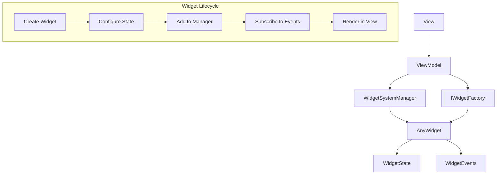
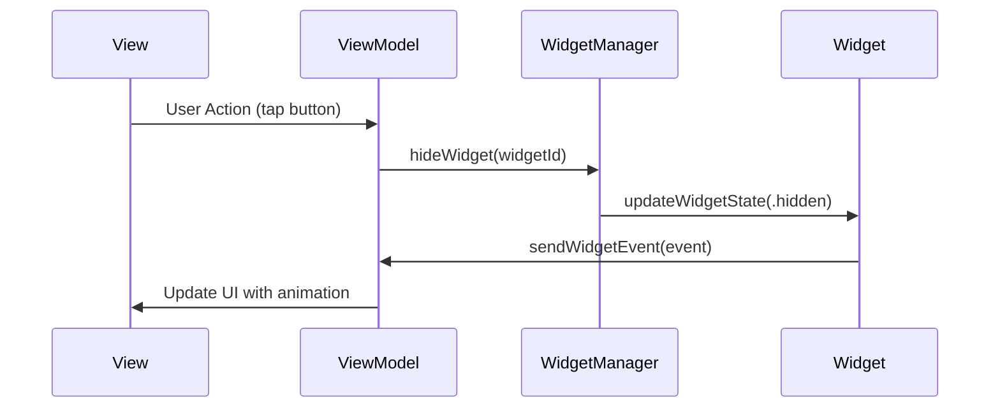

# WidgetSystemKit

A SwiftUI widget system for building modular, reusable UI components with event-driven communication and state management.

🌐 **[Visit the Website](https://dimzfresh.github.io/WidgetSystemKit)** - Interactive documentation and examples

## Features

- **Modular Widget Architecture** - Create reusable widgets with encapsulated state and behavior
- **Event-Driven Communication** - Widgets communicate through typed events using Combine
- **State Management** - Built-in state management with visibility controls (visible/hidden/disabled)
- **Reusable Components** - Factory pattern for creating and configuring widgets
- **Animation Support** - Smooth animations when showing/hiding widgets
- **Type Safety** - Generic types ensure compile-time safety

## Architecture



## Event Flow



## Quick Start

### Creating a Widget

```swift
import WidgetSystemKit
import SwiftUI

// 1. Define widget events
enum TextWidgetEvent: Equatable {
    case initial
    case didTap
    case textChanged(String)
}

// 2. Define widget state
struct TextWidgetState: Equatable {
    public let text: String
    public let fontSize: CGFloat
    public let textColor: Color
    public let alignment: TextAlignment

    public init(
        text: String = "Hello Widget!",
        fontSize: CGFloat = 16,
        textColor: Color = .primary,
        alignment: TextAlignment = .leading
    ) {
        self.text = text
        self.fontSize = fontSize
        self.textColor = textColor
        self.alignment = alignment
    }
}

// 3. Create the widget
final class TextWidget: AnyWidget<String, TextWidgetEvent> {
    @Published private(set) var state: TextWidgetState
    
    init(
        widgetId: String,
        initialState: TextWidgetState = TextWidgetState(),
        widgetState: WidgetState = .visible
    ) {
        self.state = initialState
        super.init(widgetId: widgetId, widgetState: widgetState)
        
        // Send initial event
        send(.initial)
    }
    
    override func view() -> AnyView {
        AnyView(TextWidgetView(widget: self))
    }
    
    func update(_ newState: TextWidgetState) {
        self.state = newState
    }
    
    func send(_ event: TextWidgetEvent) {
        switch event {
        case .initial:
            // Auto-hide after 3 seconds
            Task { @MainActor in
                try? await Task.sleep(for: .seconds(3))
                sendWidgetEvent(.textChanged("Updated text!"))
            }
        case .didTap:
            // Handle tap event
            sendWidgetEvent(.textChanged("Tapped!"))
        case .textChanged(let newText):
            // Update state and notify
            update(TextWidgetState(text: newText))
        }
    }
}

// 4. Create the view
struct TextWidgetView: View {
    let widget: TextWidget
    
    var body: some View {
        Text(widget.state.text)
            .font(.system(size: widget.state.fontSize))
            .foregroundColor(widget.state.textColor)
            .multilineTextAlignment(widget.state.alignment)
            .padding()
            .background(Color(.systemGray6))
            .cornerRadius(8)
            .onTapGesture {
                widget.send(.didTap)
            }
    }
}
```

### Building a Screen

```swift
struct HomeView: View {
    @StateObject private var viewModel = HomeViewModel()
    
    var body: some View {
        NavigationView {
            VStack(spacing: 0) {
                // Header
                VStack(spacing: 16) {
                    Text("Widget Demo")
                        .font(.largeTitle)
                        .fontWeight(.bold)
                        .foregroundColor(.primary)
                    
                    Text("Tap widgets to interact")
                        .font(.subheadline)
                        .foregroundColor(.secondary)
                }
                .padding(.top, 20)
                .padding(.horizontal, 20)
                
                // Widgets
                ScrollView {
                    LazyVStack(spacing: 16) {
                        ForEach(viewModel.widgets, id: \.widgetId) { widget in
                            if viewModel.isWidgetVisible(widget.widgetId) {
                                WidgetItemContainer(widget: widget) {
                                    $0.view()
                                }
                                .transition(.opacity.combined(with: .scale))
                            }
                        }
                    }
                    .padding(.horizontal, 20)
                    .padding(.top, 20)
                }
                
                Spacer()
                
                // Control Panel
                VStack(spacing: 12) {
                    Button("Toggle All Widgets") {
                        withAnimation(.easeInOut(duration: 0.3)) {
                            viewModel.toggleAllWidgets()
                        }
                    }
                    .buttonStyle(.borderedProminent)
                }
                .padding(.horizontal, 20)
                .padding(.bottom, 20)
            }
            .background(
                LinearGradient(
                    colors: [Color(.systemBackground), Color(.systemGray6)],
                    startPoint: .top,
                    endPoint: .bottom
                )
            )
        }
        .navigationBarHidden(true)
    }
}
```

### Using View Model

```swift
final class HomeViewModel: ObservableObject, IWidgetEventSubscriber {
    @Published private(set) var widgets: [AnyWidget<String, TextWidgetEvent>] = []
    @Published var isLoading = false
    @Published var errorMessage: String?
  
    private let widgetManager = WidgetSystemManager<String, TextWidgetEvent>()
    private let widgetFactory = HomeWidgetFactory()
    private var subscriptions = Set<AnyCancellable>()
    
    init() {
        setupWidgets()
        subscribeToEvents()
    }
    
    private func setupWidgets() {
        // Create widgets using factory
        let widgets = widgetFactory.buildWidgets()
        
        // Add to manager
        widgets.forEach { widget in
            widgetManager.addWidget(widget)
        }
        
        // Observe changes
        widgetManager.$widgets
            .assign(to: &$widgets)
    }
    
    private func subscribeToEvents() {
        // Subscribe to all widget events
        widgets.forEach { widget in
            widget.widgetEventPublisher
                .sink { [weak self] event in
                    self?.handleWidgetEvent(event)
                }
                .store(in: &subscriptions)
        }
    }
    
    func handleWidgetEvent(_ event: TextWidgetEvent) {
        switch event {
        case .initial:
            print("Widget initialized")
        case .didTap:
            print("Widget tapped")
        case .textChanged(let newText):
            print("Text changed to: \(newText)")
            // Update other widgets or perform actions
        }
    }
    
    // MARK: - Widget Management
    
    func hideWidget(_ widgetId: String) {
        withAnimation(.easeInOut(duration: 0.25)) {
            widgetManager.hideWidget(widgetId)
        }
    }
    
    func showWidget(_ widgetId: String) {
        withAnimation(.easeInOut(duration: 0.25)) {
            widgetManager.showWidget(widgetId)
        }
    }
    
    func toggleWidget(_ widgetId: String) {
        let state = widgetManager.widgetState(widgetId)
        if state == .visible {
            hideWidget(widgetId)
        } else {
            showWidget(widgetId)
        }
    }
    
    func toggleAllWidgets() {
        widgets.forEach { widget in
            toggleWidget(widget.widgetId)
        }
    }
    
    func isWidgetVisible(_ widgetId: String) -> Bool {
        return widgetManager.widgetState(widgetId) == .visible
    }
    
    func disableWidget(_ widgetId: String) {
        widgetManager.disableWidget(widgetId)
    }
    
    func enableWidget(_ widgetId: String) {
        widgetManager.enableWidget(widgetId)
    }
}
```

### Widget Factory

```swift
final class HomeWidgetFactory: IWidgetFactory {
    
    init() {}
    
    func buildWidgets() -> [AnyWidget<String, TextWidgetEvent>] {
        var widgets: [AnyWidget<String, TextWidgetEvent>] = []
        
        // Welcome widget
        let welcome = TextWidget(
            widgetId: "welcome_widget",
            initialState: .init(
                text: "🚀 Welcome to dynamic widgets!",
                fontSize: 28,
                textColor: .primary,
                alignment: .center
            ),
            widgetState: .visible
        )
        widgets.append(welcome)
        
        // Info widget
        let infoWidget = TextWidget(
            widgetId: "info_widget",
            initialState: .init(
                text: "Tap me to see magic happen!",
                fontSize: 16,
                textColor: .secondary,
                alignment: .leading
            ),
            widgetState: .visible
        )
        widgets.append(infoWidget)
        
        // Status widget
        let statusWidget = TextWidget(
            widgetId: "status_widget",
            initialState: .init(
                text: "Widget system is active",
                fontSize: 14,
                textColor: .green,
                alignment: .center
            ),
            widgetState: .visible
        )
        widgets.append(statusWidget)
        
        return widgets
    }
}
```

### Widget States

```swift
// Widget states control visibility and interaction
public enum WidgetState: Hashable {
    case visible    // Widget is shown and interactive
    case hidden     // Widget is hidden but preserved
    case disable    // Widget is shown but disabled
}
```

### Event Handling

```swift
// Subscribe to widget events
extension HomeViewModel: IWidgetEventSubscriber {
    func subscribe(to widget: AnyWidget<String, TextWidgetEvent>) {
        widget.widgetEventPublisher
            .sink { [weak self] event in
                self?.handleWidgetEvent(event)
            }
            .store(in: &subscriptions)
    }
}
```

## Advanced Usage

### Custom Widget Types

```swift
// Create different widget types
struct ButtonWidget: AnyWidget<String, ButtonWidgetEvent> {
    let title: String
    let action: () -> Void
    
    var body: some View {
        Button(title, action: action)
            .buttonStyle(.borderedProminent)
            .padding()
    }
}

struct ImageWidget: AnyWidget<String, ImageWidgetEvent> {
    let imageName: String
    
    var body: some View {
        Image(systemName: imageName)
            .font(.system(size: 40))
            .foregroundColor(.blue)
            .padding()
    }
}
```

### Animation Examples

```swift
// Smooth transitions when showing/hiding widgets
func showWidgetWithAnimation(_ widgetId: String) {
    withAnimation(.spring(response: 0.6, dampingFraction: 0.8)) {
        widgetManager.showWidget(widgetId)
    }
}

func hideWidgetWithAnimation(_ widgetId: String) {
    withAnimation(.easeInOut(duration: 0.3)) {
        widgetManager.hideWidget(widgetId)
    }
}
```

### Error Handling

```swift
// Handle widget errors gracefully
func handleWidgetError(_ error: WidgetError) {
    switch error {
    case .widgetNotFound(let id):
        print("Widget not found: \(id)")
    case .invalidState(let state):
        print("Invalid widget state: \(state)")
    }
}
```

## Installation

Add WidgetSystemKit to your Swift Package Manager dependencies:

```swift
dependencies: [
    .package(url: "https://github.com/dimzfresh/WidgetSystemKit.git", from: "1.0.0")
]
```

📖 **Documentation**: [Visit our website](https://dimzfresh.github.io/WidgetSystemKit) for interactive examples and detailed documentation.

## Requirements

- iOS 16.0+
- Swift 6.0+
- Xcode 15.0+

## License

This project is licensed under the MIT License - see the [LICENSE](LICENSE) file for details.
